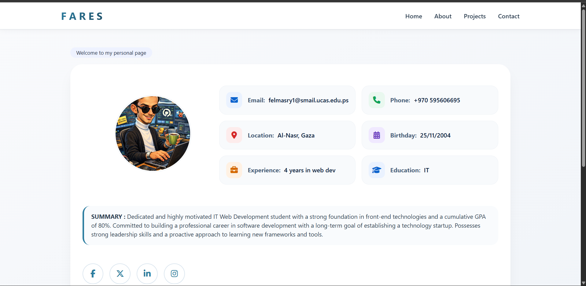

# github-training-project

## Personal Portfolio Website

A modern and responsive personal portfolio website designed to showcase personal information, skills, experience, projects, and social media links in a clean and professional way.

---

## Project Overview

This project was created as part of Git and GitHub field training.

The website presents my profile as an IT Web Development student and includes personal information, skills, projects, and social media links.

The design focuses on simplicity, readability, responsiveness, and user experience.

---

## Technologies Used

- HTML5
- CSS3
- Responsive Design
- Git
- GitHub

---

## Screenshots



---

## How to Run

1. Download or clone the repository.
2. Open the project folder.
3. Open `index.html` in any web browser.

---

## Project Structure

```bash
project-folder/
│
├── index.html
├── style.css
├── README.md
├── screenshot.png
```

---

## Student Name

Updated after branch
Fares Almasry
